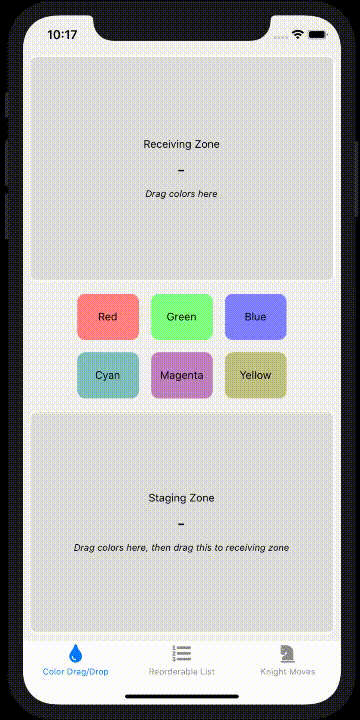
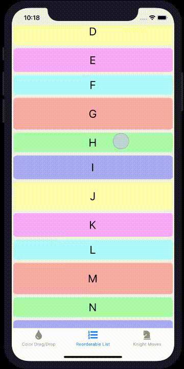
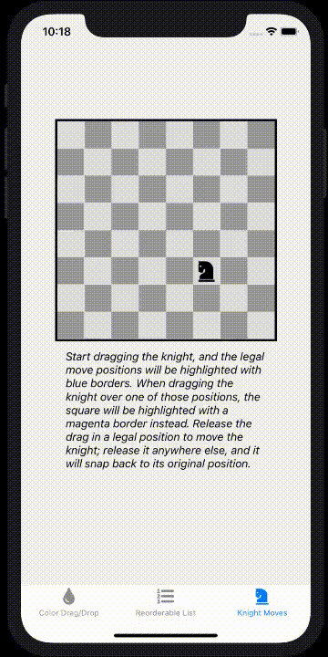

# react-native-drax-example

**A demonstration of a drag-and-drop system for React Native**

[](CODE-OF-CONDUCT.md)

## Overview

[Drax](https://github.com/nuclearpasta/react-native-drax) is a declarative drag-and-drop system for React Native, written in TypeScript. This repository contains a React Native application which uses the `react-native-drax` library to demonstrate several examples for reference.

**IMPORTANT: This example project has not been updated to the latest Drax. As of Drax 0.10.0, React Native >=0.65 is required. This project is still on Drax 0.9.3 and RN 0.63.3, and the maintainer does not currently have availability to refresh it. [Contributors are welcome!](#contributing)

#### Contents

* [Screenshots](#screenshots)
* [Usage](#usage)
* [Contributing](#contributing)
* [Code of Conduct](#code-of-conduct)
* [License](#license)


<a name="screenshots"></a>
## Screenshots

<a href="images/color-drag-drop.gif"></a>
<a href="images/reorderable-list.gif"></a>
<a href="images/knight-moves.gif"></a>

(Click images to see larger versions.)

<a name="usage"></a>
## Usage

For the time being, these instructions assume that your environment is already prepared for React Native development. Simply clone the repository, install the dependencies, and run the application as usual. For example:

```
$ git clone https://github.com/nuclearpasta/react-native-drax-example.git
$ cd react-native-drax-example
$ yarn
$ cd ios; pod install; cd ..
$ yarn run ios
```

Note that during the build you will see an error like this:
```
error React Native CLI uses autolinking for native dependencies, but the following modules are linked manually:
  - react-native-vector-icons (to unlink run: "react-native unlink react-native-vector-icons")
```

This is expected and will continue until [react-native-vector-icons](https://github.com/oblador/react-native-vector-icons/) has [full autolinking support](https://github.com/oblador/react-native-vector-icons/issues/1185). You can ignore the message.

<a name="contributing"></a>
## Contributing

See the [Contribution Guidelines](https://github.com/nuclearpasta/react-native-drax/blob/master/CONTRIBUTING.md) in the `react-native-drax` repository for details.

<a name="code-of-conduct"></a>
## Code of Conduct

Please note that this project is released with a [Contributor Code of Conduct](https://github.com/nuclearpasta/react-native-drax/blob/master/CODE-OF-CONDUCT.md). By participating in this project you agree to abide by its terms.

<a name="license"></a>
## License

This software is licensed under the [MIT License](LICENSE.md).
